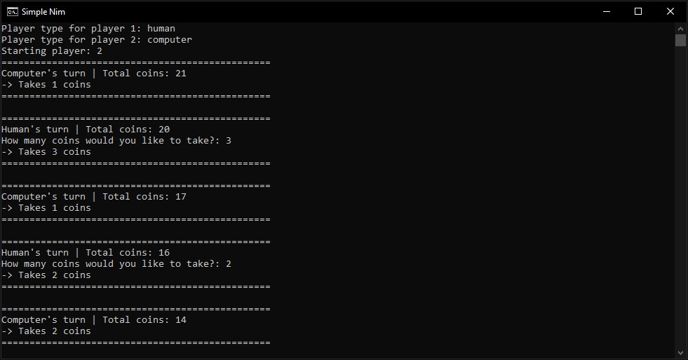

# Simple Nim

[](https://en.wikipedia.org/wiki/Python_(programming_language)) 
[](https://github.com/Tosox/Simple-Nim)
[](https://github.com/Tosox/Simple-Nim)

**A simple game of Nim written in Python**

> Important Note: The AI isn't implemented yet and is instead using the logic of a random player

## Usage

```bash
# Example
> python ./simple_nim.py -p1 Human -p2 Computer --rand 1
```

_Alternatively, simply execute ['play.bat'](play.bat)_

| Arguments     | Description                | Accepted input                         | Notes                       |
|---------------|----------------------------|----------------------------------------|-----------------------------|
| -p1           | Player type for player 1   | Human, Computer, Random, AI            |                             |
| -p2           | Player type for player 2   | Human, Computer, Random, AI            |                             |
| --rand        | Starting player            | 0 (Random), 1 (Player 1), 2 (Player 2) | Optional - Defaults to 0    |

## Rules

Two players will each take one, two or three coins at a time from a heap containing 21 coins.
The player who has no coins to retrieve from the heap loses.

## Preview



## More Information

* https://en.wikipedia.org/wiki/Nim
* https://www.transum.org/Software/sw/Starter_of_the_day/Starter_May29.asp
* https://www.researchgate.net/publication/221330080_Evolving_Winning_Strategies_for_Nim-like_Games
